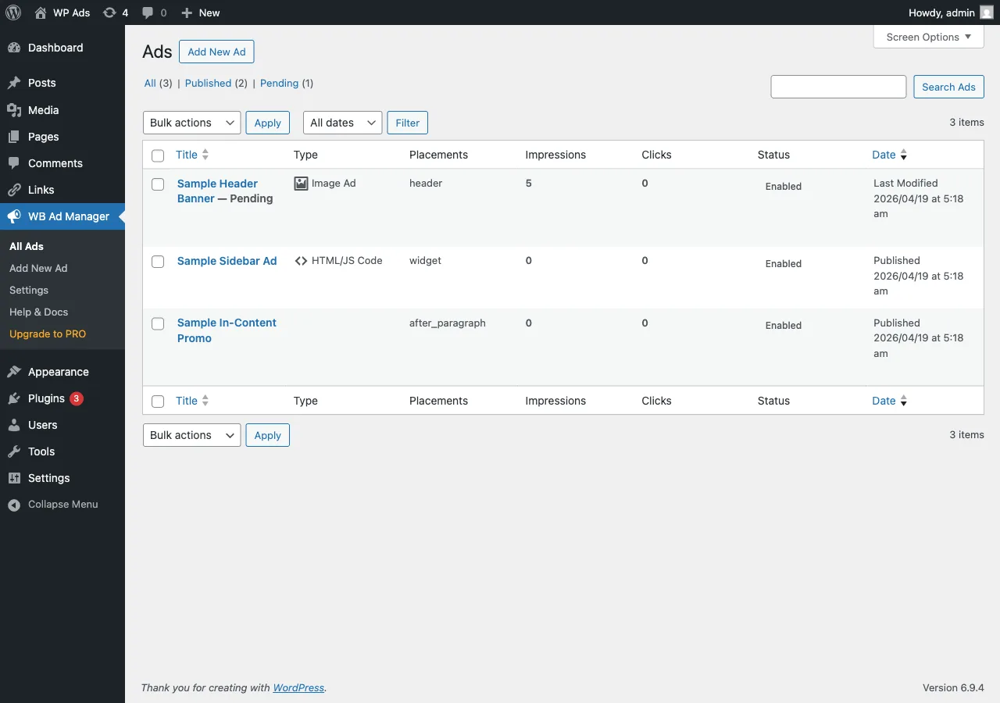

# Installing WB Ad Manager

WB Ad Manager is the free ad-management plugin from Wbcom Designs. This guide takes you from zero to an active install you can verify.

## Requirements

| Requirement | Minimum |
|-------------|---------|
| WordPress | 5.8 or higher |
| PHP | 7.4 or higher |
| User role | Administrator (`manage_options`) |

## Install from the WordPress dashboard

1. Go to **Plugins -> Add New**.
2. Search for **WB Ad Manager**.
3. Click **Install Now**, then **Activate**.

## Install by uploading a ZIP

If you downloaded the plugin ZIP from wbcomdesigns.com:

1. Go to **Plugins -> Add New -> Upload Plugin**.
2. Choose the ZIP file.
3. Click **Install Now**, then **Activate**.

## What happens on activation

On first activation the plugin:

- Creates the **Ads** post type and its admin menu (icon: megaphone).
- Creates its database tables for click/impression tracking, links, and captured emails.
- Redirects you to the **Setup Wizard** so you can seed sample ads (see [Setup Wizard](../usage/20-setup-wizard.md)).

## After activation

You will see a **WB Ad Manager** menu in the admin sidebar with:

- **Ads** - create and manage advertisements
- **Ad Tags** - group ads by sponsor, season, or campaign
- **Settings** - global ad behaviour
- **Links** - tracked and cloaked outbound links (when the Links module is on)
- **Help & Docs** and **Upgrade to PRO**

## Verify the install

1. Publish one ad (see [Quick Setup](10-quick-setup.md)).
2. Add `[wbam_ad id="123"]` to any page, replacing `123` with the real ad ID.
3. View the page on the front end - the ad should render.

## Next steps

- [Quick Setup](10-quick-setup.md) - publish your first ad in a few minutes.
- [Ad Types](../features/00-ad-types.md) - pick the right ad format.

## Troubleshooting

If the plugin will not activate, confirm PHP 7.4+ and WordPress 5.8+, then check the error log. See [Common Issues](../troubleshooting/00-common-issues.md).
