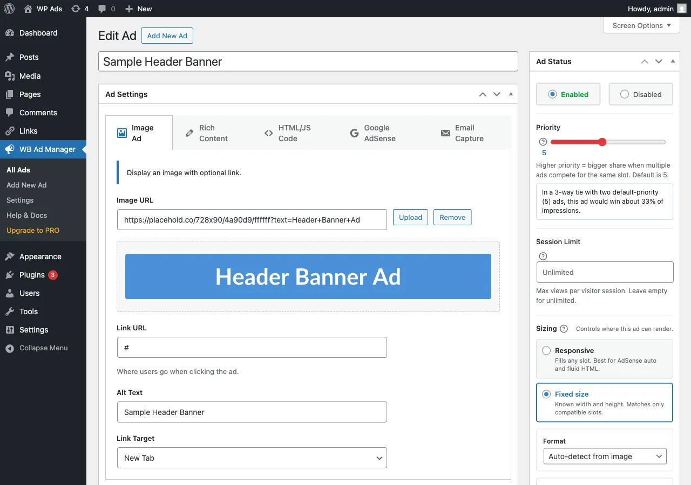

# Quick Setup

Publish your first ad and see it on the front end. There are no zones to build - each ad carries its own placement checkboxes, and ads sharing a placement rotate automatically.

## Step 1 - Create an ad

1. Go to **WB Ad Manager -> Ads -> Add New**.
2. Enter a **Title** (internal reference only - visitors never see it).
3. In the **Ad Settings** metabox, choose an ad type: Image, Rich Content, HTML/JS Code, Google AdSense, or Email Capture.
4. Fill in the content for that type (see [Ad Types](../features/00-ad-types.md)).
5. In the **Placements** metabox, check where the ad should appear (header, footer, content, and more).
6. In the **Ad Status** metabox, set **Priority** (1-10, default 5) - higher priority wins a bigger share of impressions when ads compete for the same slot.
7. Click **Publish**.



## Step 2 - Display the ad

You have two ways to place ads:

- **Automatic placements** - the boxes you checked in the Placements metabox. No shortcode needed.
- **Shortcodes** - drop an ad anywhere by ID:

```
[wbam_ad id="123"]
```

Display several specific ads at once:

```
[wbam_ads ids="1,2,3"]
```

See [Ad Shortcodes](../shortcodes/00-ad-shortcodes.md) for all attributes.

## Step 3 - Verify and track

1. Visit a page where the ad should show.
2. Click the ad to test tracking.
3. Return to **WB Ad Manager -> Ads** - impressions and clicks appear per ad in the list.

## Ad statuses

| Status | Meaning |
|--------|---------|
| Published | Live and eligible to show |
| Draft | Saved, not live |
| Scheduled (start date set) | Goes live on its start date |
| Disabled | Turned off with the Enabled toggle in the Ad Status metabox |

## Next steps

- [Placements](../features/10-placements.md) - every location an ad can appear.
- [Rotation and Split Testing](../features/20-rotation-and-split-testing.md) - how the winning ad is chosen.
- [Targeting and Scheduling](../features/30-targeting-and-scheduling.md) - control who sees each ad and when.
