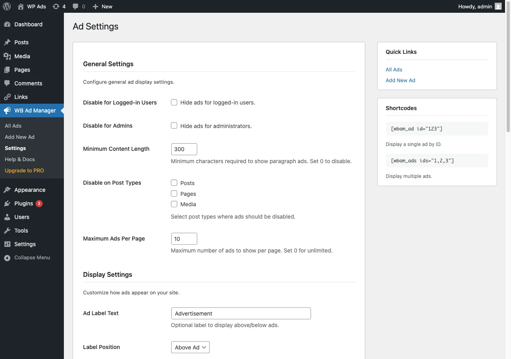

# Settings

Everything lives on one screen: **Ad Manager -> Settings**, with a section menu on the left. Settings are stored in the `wbam_settings` option. WB Ad Manager Pro adds its own sections and cards to the same screen (see the Pro docs).

## General

| Setting | What it does | Default |
|---------|--------------|---------|
| Enable the Link Manager | Turns the Links menu (outbound and affiliate links, link categories, partnership inquiries) on or off. Off only hides the screens: links you already published keep redirecting and counting clicks, and their data is kept. | On |

## Ads & Display

### Who sees ads

Everyone sees ads unless you hide them from someone here.

| Setting | What it does | Default |
|---------|--------------|---------|
| Hide from logged-in users | Only visitors who are not logged in see ads | Off |
| Hide from administrators | Site administrators browse without ads (handy while testing) | Off |

### Display Settings

| Setting | What it does | Default |
|---------|--------------|---------|
| Hide ads on single pages of these types | A single post, page or item of a ticked type shows no ads. Archives and lists still do. | None |
| Maximum Ads Per Page | The most ads one page shows, counted across every placement, widget and shortcode. Limits set per placement still apply inside it. 0 means no limit. | 10 |
| Ad Label Text | A disclosure label shown with each ad; empty turns it off. Email Capture ads (your own signup form) skip it; developers can change that with the `wbam_show_ad_label` filter. | `Advertisement` |
| Label Position | Above or below the ad | Above |

To add your own CSS class to ad containers, use the `wbam_ad_container_class` filter (see [Hooks and Filters](../developer-guide/010-hooks-and-filters.md)).

### Placements

A table of every placement: **On** decides whether the placement may show ads on this site, and **Live ads** counts the ads that can show there right now (published, switched on, in date, with their creative, and a size that fits). Unticking a placement with live ads asks you to confirm. **Format Matching** keeps an ad out of placements its size does not fit. See [Placements](../features/010-placements.md).

### Google AdSense

| Setting | What it does | Default |
|---------|--------------|---------|
| Publisher ID | Your AdSense Publisher ID (`ca-pub-...`), the default for AdSense ads | (empty) |
| Auto Ads | Google places ads across your site on its own. Needs the Publisher ID; without one it stays off. | Off |
| Require Consent for AdSense | AdSense loads only after the visitor consents (works with common consent plugins) | Off |

See [Google AdSense](../integrations/030-google-adsense.md).

## Links

Shown while the Link Manager is on.

| Setting | What it does | Default |
|---------|--------------|---------|
| Link URL Prefix | The path for cloaked links, e.g. `yoursite.com/go/book`. Links published under an earlier prefix keep working after you change it. | `go` |
| Inactive Link Action | What an inactive or expired cloaked link does: show a 404, go to the home page, or go to a custom URL | Show 404 |
| Inactive Link URL | Where visitors go for the custom URL option (shown only for that option) | (empty) |

## Location

Geolocation is off until you turn it on; no visitor IP is looked up or sent anywhere before that.

| Setting | What it does | Default |
|---------|--------------|---------|
| Geolocation | Look up each visitor's country so ads can use country rules | Off |
| Provider | **MaxMind database (local file)**: nothing leaves your site. **HTTPS API (ipinfo.io)**: the visitor's IP goes to ipinfo.io with your own key. | (none) |
| MaxMind Database | Upload the GeoLite2 Country `.mmdb` file from your free MaxMind account; the path fills in for you | (empty) |
| ipinfo.io API Key | Your ipinfo.io key (a password field) | (empty) |

Sites upgraded from before 3.2.0 keep the provider they used (ip-api.com or ipapi.co) until they switch; the screen recommends switching.

## Privacy & Data

Visitor IP addresses are always stored as a one-way hash, never the raw address. Views and clicks from bots and logged-in administrators are not counted.

| Setting | What it does | Default |
|---------|--------------|---------|
| Delete Data on Uninstall (Danger Zone) | When the plugin is deleted, remove everything it lists: ads, links, analytics, email captures, tables and settings. Turning it on asks you to confirm. | Off |

While it is off, deleting the plugin keeps all your data.

## Tools & License

**Sample content** removes the sample ads the setup wizard added, or says there are none. With Pro, this section also holds the license key.

## Next steps

- [Placements](../features/010-placements.md)
- [Setup Wizard](020-setup-wizard.md)
