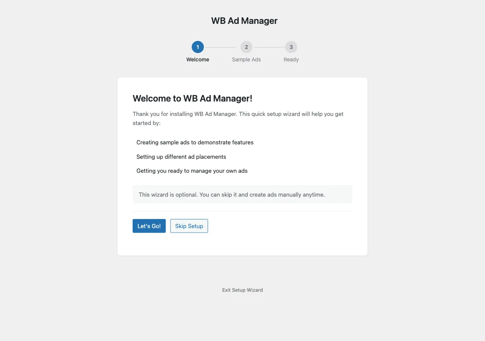

# Setup Wizard

The Setup Wizard runs the first time you activate WB Ad Manager. In three short steps it adds sample ads so you can see where ads show on your site. It is optional: skip it and create your own ads any time. To open it again, use **Run Setup Wizard** on the first-run notice, or go to `wp-admin/index.php?page=wbam-setup`.

## The steps

1. **Welcome** - what the wizard adds, and what Free and Pro each do (Free: show your own ads and AdSense; Pro: sell ad spots to advertisers).
2. **Sample Ads** - pick the samples to add: a header banner, a sidebar ad, and an ad inside posts. Visitors will see these until you replace or remove them. On a theme with widget areas the sidebar sample goes into your first sidebar; on a block theme you show it with the `[wbam_ad]` shortcode.
3. **Ready** - links to **View Your Site**, **View Your Ads**, **Create New Ad** and **Settings**, plus a button to remove the sample ads.

## What the sample ads say

Each sample reads "Sample ad - replace me in WB Ad Manager". With WB Ad Manager Pro and a published Advertise page, the samples add an "Advertise on this site" link to it; otherwise they have no link.

## Removing the sample ads

Use **Remove sample ads** on the Ready step, or **Settings -> Tools & License -> Sample content**. Only the ads the wizard added are removed; your own ads are never touched.

## Skipping the wizard

Click **Skip Setup** and go straight to **Ad Manager -> Add New Ad**. See [Quick Setup](../getting-started/010-quick-setup.md).

## Next steps

- [Quick Setup](../getting-started/010-quick-setup.md)
- [Settings](010-settings.md)
