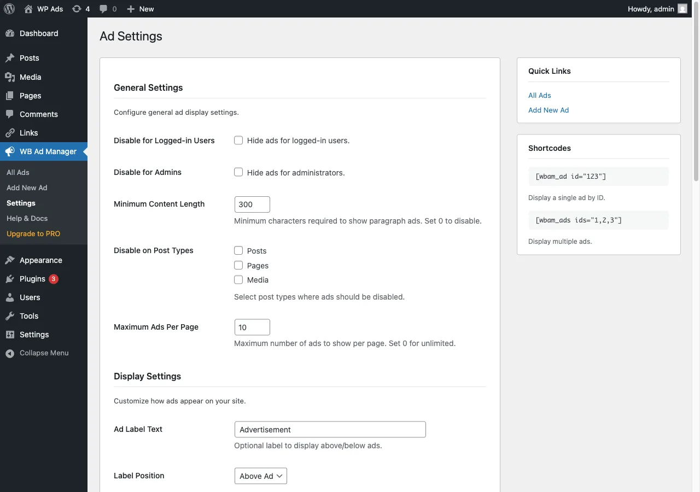

# Settings

Configure global ad behaviour at **WB Ad Manager -> Settings**. Every setting below is stored in the `wbam_settings` option. (When WB Ad Manager Pro is active this screen is titled **Ad Display**.)

## Features

Shown only in the free plugin (hidden when Pro is active).

| Setting | What it does | Default |
|---------|--------------|---------|
| Links module | Turns the Link Manager on or off. Turning it off only hides the menu; your link data is kept. | On |

## General

| Setting | What it does | Default |
|---------|--------------|---------|
| Disable for logged-in users | Hide all ads from logged-in users | Off |
| Disable for admins | Hide all ads from administrators (handy while testing) | Off |
| Disable on post types | Post types where automatic placements never show | None |
| Maximum ads per page | Cap ads shown per page; 0 means unlimited | 10 |

## Display

| Setting | What it does | Default |
|---------|--------------|---------|
| Ad label text | Optional label shown with each ad (e.g. "Advertisement"); leave empty to disable | `Advertisement` |
| Label position | Show the label above or below the ad | Above |
| Custom container class | Extra CSS class added to ad containers | (empty) |

## Placements

A matrix of which placement slots may serve ads on your site. By default every placement is open. See [Placements](../features/10-placements.md).

## Geo Targeting

| Setting | What it does | Default |
|---------|--------------|---------|
| Primary provider | IP-geolocation service: `ip-api` (45/min, no key), `ipinfo` (50K/month, optional key), `ipapi-co` (1K/day, no key). Falls through to the next on failure. | `ip-api` |
| ipinfo.io API key | Optional key for ipinfo.io | (empty) |

## Google AdSense

| Setting | What it does | Default |
|---------|--------------|---------|
| Publisher ID | Your AdSense Publisher ID (`ca-pub-...`), used as the default for AdSense ads | (empty) |
| Auto Ads | Enable AdSense Auto Ads site-wide | Off |

See [Google AdSense](../integrations/30-google-adsense.md).

## Privacy & GDPR

| Setting | What it does | Default |
|---------|--------------|---------|
| Require consent for AdSense | Load AdSense scripts only after visitor consent (works with common consent plugins) | Off |
| Anonymize IP | Store anonymized IP hashes instead of raw IPs | On |

## Advanced

| Setting | What it does | Default |
|---------|--------------|---------|
| Delete data on uninstall | Delete all ads, links, analytics, tables, and settings when the plugin is uninstalled | Off |

When this is off (the default), uninstalling the plugin keeps all your data.

## Link Cloaking

| Setting | What it does | Default |
|---------|--------------|---------|
| Cloak prefix | URL segment for cloaked links, e.g. `go`. Rewrite rules refresh on change. | `go` |
| Inactive link action | Behaviour for an inactive/expired cloaked link: show 404, redirect home, or redirect to a custom URL | Show 404 |
| Inactive link URL | Destination for the "redirect to custom URL" option | (empty) |

## Next steps

- [Placements](../features/10-placements.md)
- [Setup Wizard](20-setup-wizard.md)
