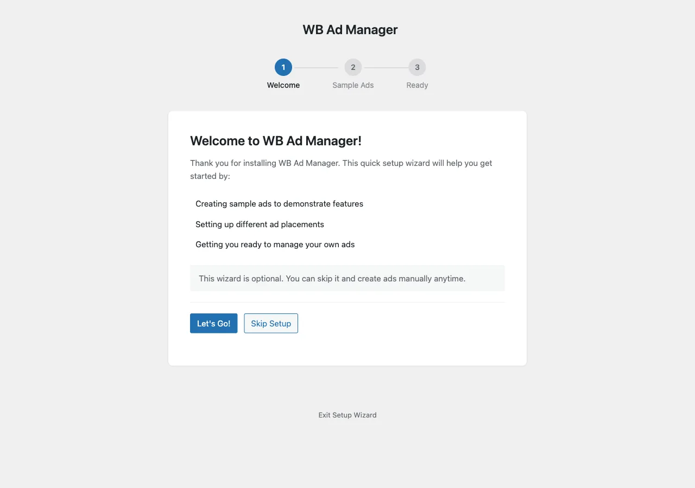

# Setup Wizard

The Setup Wizard runs the first time you activate WB Ad Manager and gets you to a working demo in about a minute. You can re-open it any time from **Dashboard -> WB Ad Manager Setup**.

## What it does

The wizard walks a short first-run flow and can seed sample ads so you can see placements and rotation working immediately, before you create your own ads.

## Removing the sample data

Everything the wizard creates is tagged as demo data. To remove it later, use the one-click **Demo Data** cleanup in the admin - it deletes only the rows the wizard seeded (matched against the demo-data flag), leaving your own ads untouched.

## Skipping the wizard

If you would rather start from scratch, close the wizard and go straight to **WB Ad Manager -> Ads -> Add New**. See [Quick Setup](../getting-started/10-quick-setup.md).

## Next steps

- [Quick Setup](../getting-started/10-quick-setup.md)
- [Settings](10-settings.md)
